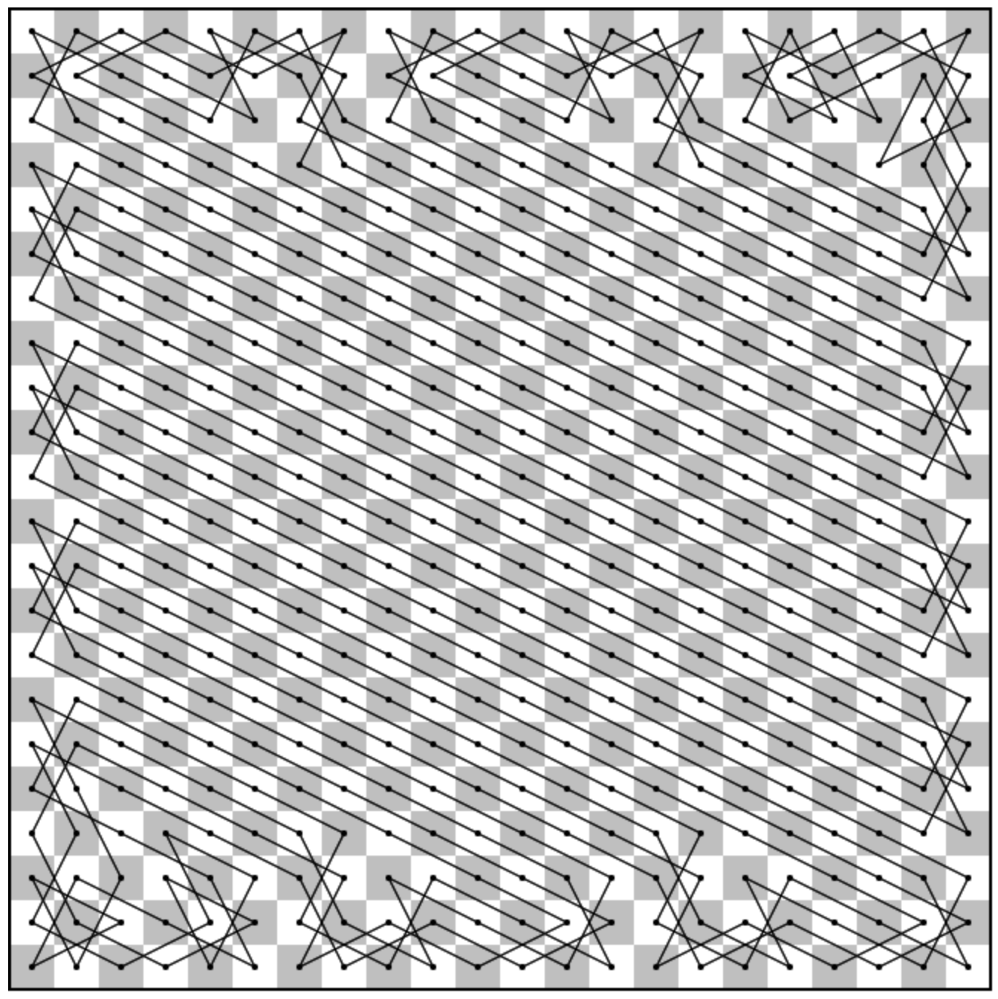

This repo contains an **[interactive demo](https://nmamano.github.io/MinCrossingsKnightsTour/index.html)** of our algorithm for finding knight tours with a small number of turns and crossings.

From the paper:

J.J. Besa, T. Johnson, N. Mamano, M.C. Osegueda, "Taming the Knight's Tour: Minimizing Turns and Crossings," [preprint available online](https://arxiv.org/pdf/1904.02824.pdf)

The repo also contains some scripts we used in the project.
