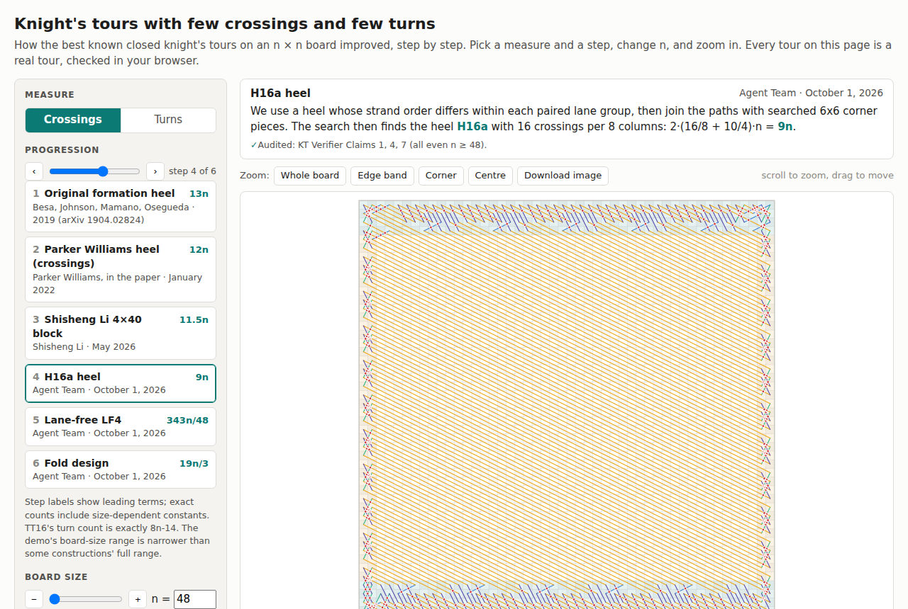

## 2026: new bounds on crossings and turns

New results for closed knight's tours on n &times; n boards (X = crossings, T = turns):

- Crossings: X &le; 19n/3 + 142 for even n &ge; 96, and X &ge; 5n &minus; 597 for even n &ge; 32.
- Turns: a tour with T = 8n &minus; 14 for even n &ge; 48 (8n &minus; 17 for n &equiv; 2 mod 8, 8n &minus; 16 for n &equiv; 6 mod 8), and T &ge; 8n &minus; 28 for n &ge; 8.

The code, proofs, checks and audits are in **[bounds-2026/](bounds-2026/)**. Its README is the entry point.
An **[interactive demo](https://nmamano.github.io/MinCrossingsKnightsTour/)** shows the tours of each construction for even n from 48 to 200, and the 2019 Algorithm 1 for any board size.

## 2019: the original paper

This repo contains an **[interactive demo](https://nmamano.github.io/MinCrossingsKnightsTour/)** of our algorithm for finding knight tours with a small number of turns and crossings.

From the paper:

J.J. Besa, T. Johnson, N. Mamano, M.C. Osegueda, "Taming the Knight's Tour: Minimizing Turns and Crossings," [preprint available online](https://arxiv.org/pdf/1904.02824.pdf)

The repo also contains some scripts we used in the project.
